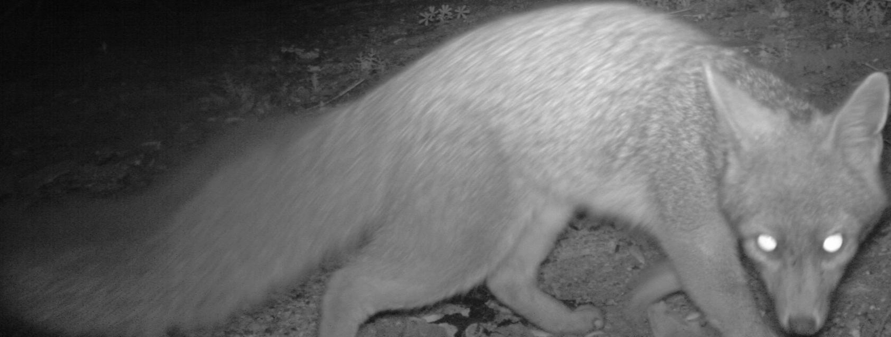

# Few-Shot Learning for Animal Classification in Camera Traps Using an Infrared_Camera


## Dataset
### Overview
* Wildlife Conservation Society (WCS)
  * Wildlife image dataset captured by camera traps installed in nature reserves across 12 countries (South America and Asia)
  * 28 classes, 500 image per class
  * [Official Website](https://library.wcs.org/en-us/)
  * [Download Page](https://lila.science/datasets/wcscameratraps)
* Caltech Camera Traps (CCT)
  * Wildlife image dataset captured by camera traps installed at 140 locations in Southwestern United States
  * 11 classes, 100 images per class
  * [Official Website](https://beerys.github.io/CaltechCameraTraps/)
  * [Download Page](https://lila.science/datasets/caltech-camera-traps)

### How were these datasets created?
Download CCT and WCS from the download pages listed above
* Wildlife Conservation Society
  1. Extracted Infrare Images
  * Sort images from `wcs-unzipped/animals` folder into `infrared_bboxes`folder or `color_bboxes` folder by category
  * Crop images based on bounding boxes
  ```
  python preprocessing_wcs_IR.py
  python preprocessing_wcs_color.py
  ```
  2. Count Images per Category
  * Create JSON file
  ```
  python count_category_and_num.py
  ```
  3. Compare Visible Light and Infrared Images
  * Create CSV file
  ```
  python compare_color_and_IR.py
  ```
  4. Create Dateset
  * Include categories with more than 100 images in the dataset
  * Standardize eave category to contain 100 images
  ```
  python make_wcs_dataset.py
  ```

* Caltech Camera Traps
  1. Extracted Infrare Images
  * Sort images from `cct_image` folder into `infrared_bboxes`folder or `color_bboxes` folder by category
  * Crop images based on bounding boxes
  ```
  python preprocessing_wcs_IR.py
  python preprocessing_wcs_color.py
  ```
  2. Count Images per Category
  * Create JSON file
  ```
  python count_category_and_num.py
  ```
  3. Compare Visible Light and Infrared Images
  * Create CSV file
  ```
  python compare_color_and_IR.py
  ```
  4. Create Dateset
  * Include categories with more than 100 images in the dataset
  * Standardize eave category to contain 100 images
  ```
  python make_wcs_dataset.py
  ```

## Disclaimer
* Users must independently verify and comply with the most current terms of use from each organization
* This derivative work maintains the copyright and license requirements of the original datasets